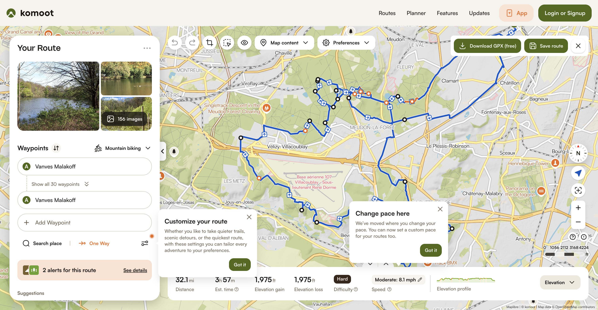
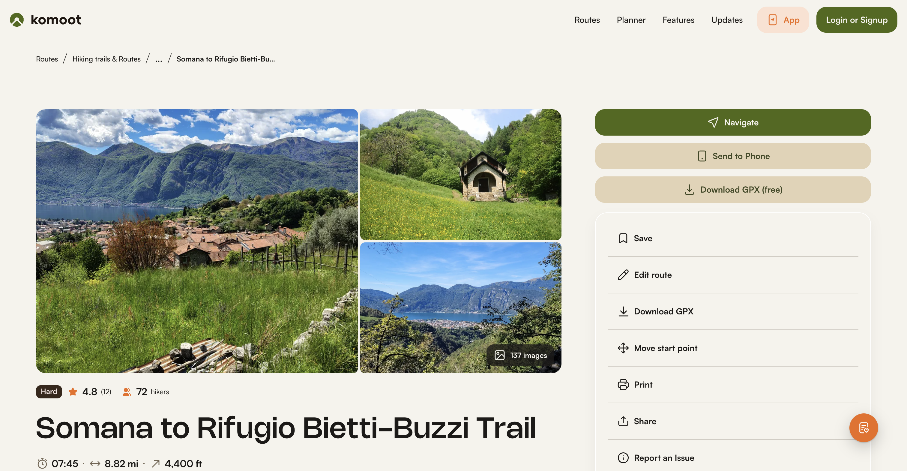
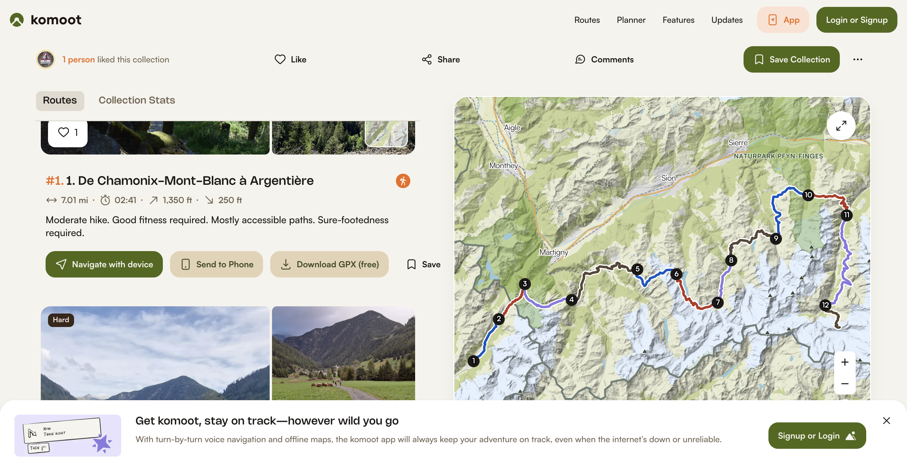

# GPX Downloader for Komoot

## What this Extension does
This extension allows you to download GPX tracks from Komoot for free, without a subscription. It works on three types of pages:

- **Route planner** — adds a `Download GPX (free)` button next to `Save route`
- **Tour pages** — adds a `Download GPX (free)` button next to `Send to Phone`
- **Collections** — adds a `Download GPX (free)` button on each leg of the collection

Downloaded files are named after the tour or collection (e.g. `Somana to Rifugio Bietti-Buzzi Trail.gpx`, `De Chamonix a Zermatt - 1. De Chamonix-Mont-Blanc à Argentière.gpx`).

## Installation
Since this extension is not available on the Chrome Web Store, you have to install it manually. However the process is quite simple.

1. Click on `Code->Download Zip`
2. Unpack the Zip file somewhere on your Computer
3. Open `chrome://extensions/`
4. Enable Developer Mode by toggling the switch in the top right-hand corner
5. Click `Load unpacked` and select the folder where you extracted the file to

## Screenshots

### Route planner

### Tour page

### Collection page

